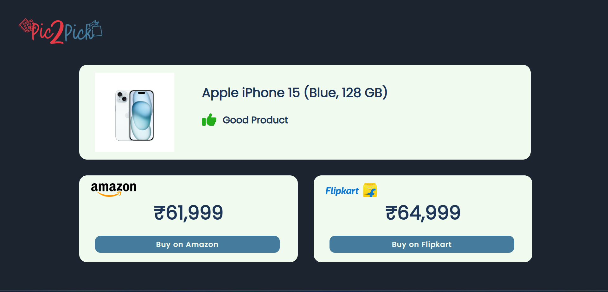
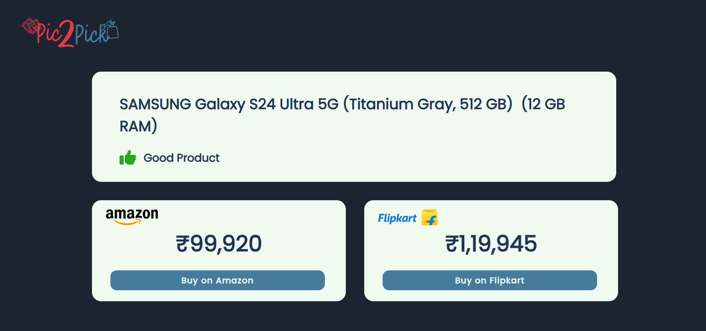

# Pic2Pick
Pic2Pick is an AI-powered product comparison tool that lets users upload an image of any product and instantly view the product’s price and details from Amazon and Flipkart, along with an intelligent review analysis.
It combines the power of image recognition, web scraping, and sentiment analysis to deliver a seamless product search experience.

## Features
- Image-based product search using Google Lens via SerpApi
- Price comparison from Amazon and Flipkart using real-time web scraping
- Review sentiment analysis to show if people love or hate the product
- Clean and responsive frontend UI built with Vite + React
- Seamless image upload via Imgur
- Fast backend powered by Flask

## How It Works
1. User uploads a product image.
2. The backend uses SerpApi (Google Lens) to extract the product name.
3. Product name is used to scrape data from Flipkart and Amazon.
4. Scraped reviews are passed through a sentiment analysis model.
5. Frontend displays:
   - Product title
   - Price
   - Product URL
   - Review summary with sentiment score

## Screenshots:
### Homepage - Image Search

### Result - Image Search

### Homepage - Text Search

### Result - Text Search

